# Phase 01 - Identity, Access and Governance

## Overview

This phase establishes the identity and access foundation for the lab 
environment. It covers role-based access control, just-in-time privileged 
access, conditional access policies, identity threat detection, application 
identity governance, and AI agent identity management.

Every control implemented here answers a specific attack scenario. The 
attacker mindset is documented alongside each configuration to show not 
just what was built, but why it matters in a real threat environment.

---

## Environment

**Tenant:** Wardenix (Microsoft Entra ID)
**Subscription:** Azure Subscription 1
**Resource group:** rg-azure-seceng-project (West Europe)
**Entra ID license:** Microsoft Entra ID P2

### Lab Users

| User | Role | Department |
|---|---|---|
| Yetunde Duze | Global Administrator | IT |
| Wale Ibrahim | Identity Administrator | IT |
| Mei Chen | Cloud Administrator | IT |
| David Okafor | Chief Executive Officer | Executive |
| Sofia Larsen | Chief Financial Officer | Executive |
| Ama Mensah | HR Director | HR |
| Kwame Osei | Operations Manager | Operations |
| Anna Kowalski | Financial Analyst | Finance |
| Emre Yilmaz | Accounts Payable | Finance |
| Tim Contractor | External Consultant | Contractors |
| BreakGlass Admin | Break-Glass Account | IT |

---

## Part 1 - Role-Based Access Control (RBAC)

### What Was Built

Azure RBAC controls who can do what across Azure resources. The first 
step was creating the resource group that houses all lab resources, 
then establishing a least-privilege role assignment model.

**Resource group created:** `rg-azure-seceng-project`

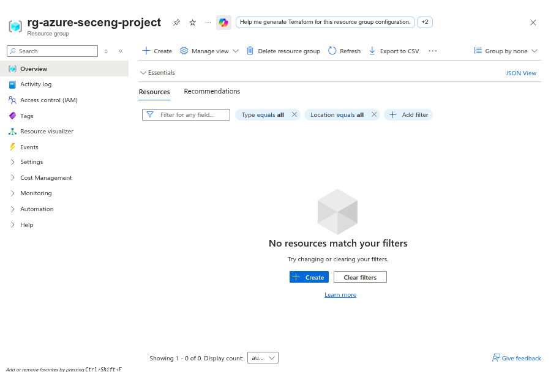

**Role assignments configured:**

- Kwame Osei - Reader (resource group scope) - operations staff 
  can view resources but cannot modify them
- mi-asl-app (Managed Identity) - Reader (resource group scope) - 
  the application identity can read resources without storing credentials
- Tim Contractor - Reader (resource group scope, time-bound eligible) - 
  external consultant access is JIT and expires automatically
- Wale Ibrahim - Owner (eligible via PIM - not active permanently)
- Yetunde Duze - Owner (inherited from subscription)

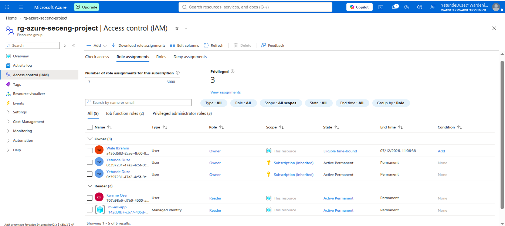

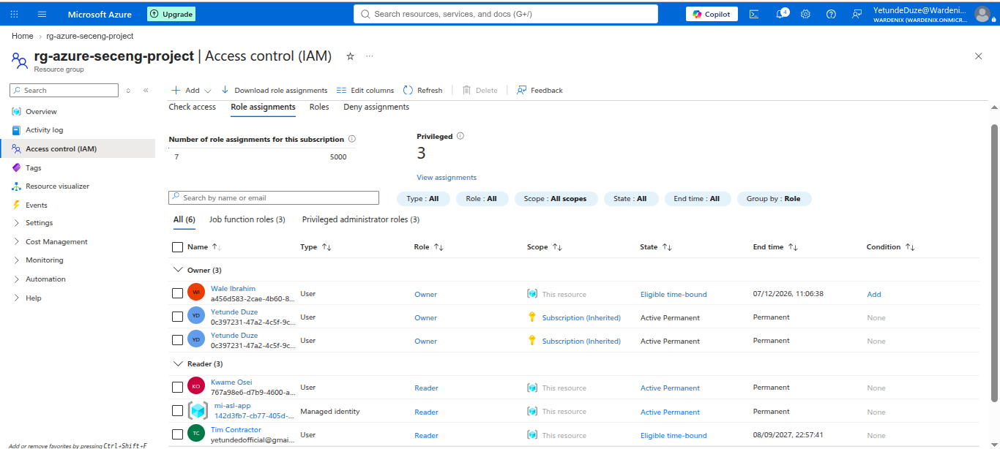

### Custom RBAC Role

A custom role `NullCorp-SecurityReader` was created to grant read access 
only to security-relevant resources - Key Vault metadata, NSGs, and 
security policies - without granting broad Reader access across all 
resource types including billing.

**Separation of duties applied to attribute management:**

Mei Chen (Cloud Administrator) was assigned the 
**Attribute Definition Administrator** role - she defines what custom 
security attributes exist. Wale Ibrahim (Identity Administrator) was 
assigned **Attribute Assignment Administrator** - he assigns those 
attributes to objects. Neither role was assigned to Yetunde Duze 
(Global Administrator), preserving separation of duties. Global 
Administrator does not automatically inherit custom security attribute 
permissions in Microsoft Entra ID by design.

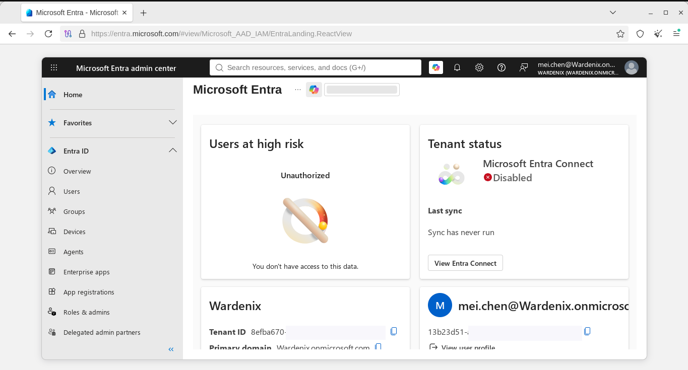

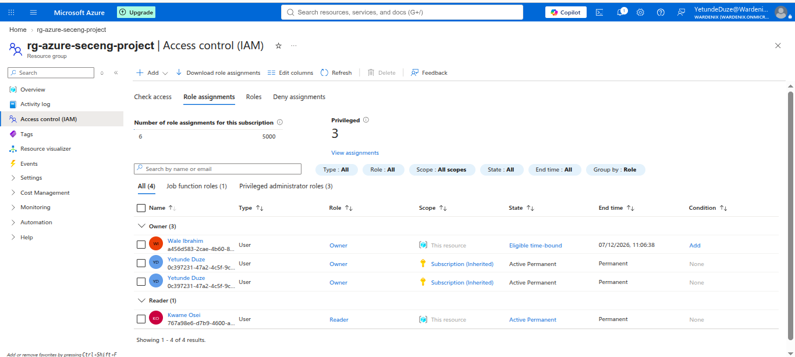

### Attacker Mindset

Overprivileged accounts are one of the most exploited conditions in 
cloud breaches. An attacker who compromises an account with permanent 
Owner access owns the entire subscription indefinitely. Scoping roles 
to the minimum required resource and using time-bound assignments 
significantly reduces the blast radius of any single compromised 
account.

---

## Part 2 - Privileged Identity Management (PIM)

### What Was Built

PIM enforces just-in-time (JIT) privileged access. No user holds 
standing Owner access - permissions must be requested, justified, 
approved, and are automatically revoked after a time window.

**Owner role settings configured:**

- Maximum activation duration: 1 hour
- Azure MFA required on activation
- Justification required
- Approval required (approver: Yetunde Duze)
- Active assignments expire after 8 hours

**Wale Ibrahim** was made eligible for Owner on 
`rg-azure-seceng-project` - not active. He must request access, 
provide a justification, and wait for approval before any Owner 
permissions are granted.

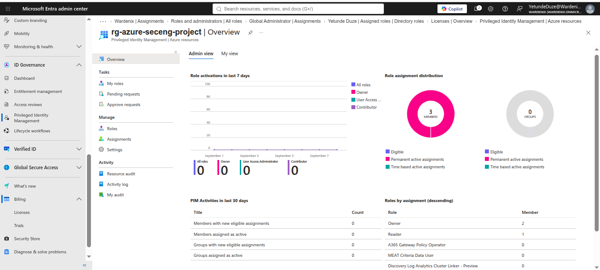

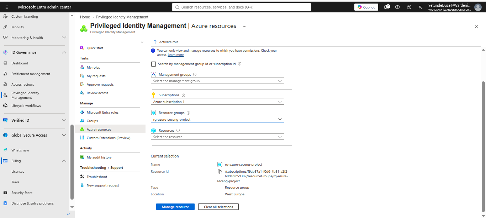

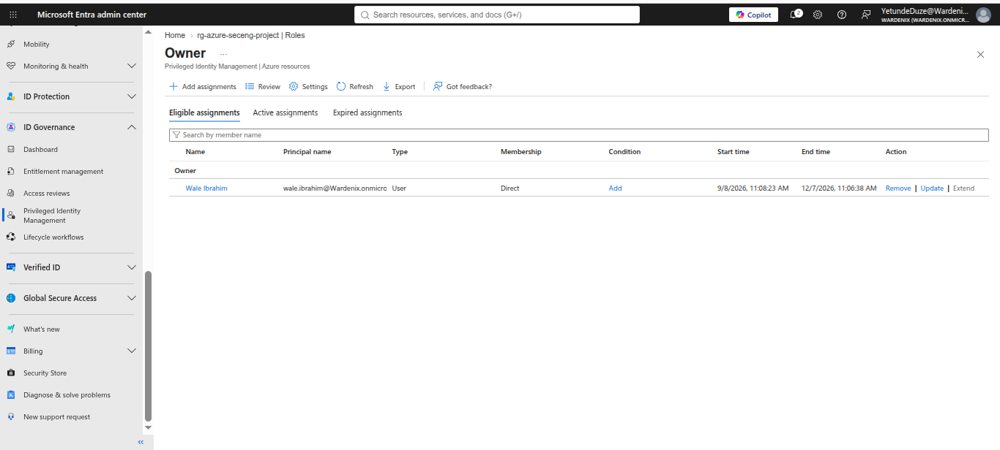

### JIT Workflow Test

The full activation workflow was tested end-to-end:

1. Wale Ibrahim signed in and navigated to PIM - My roles - Azure resources
2. Clicked Activate on the Owner eligible assignment
3. Entered justification: *"Testing JIT access workflow for Phase 1 
   security engineering lab"*
4. Yetunde Duze received the approval request and approved it

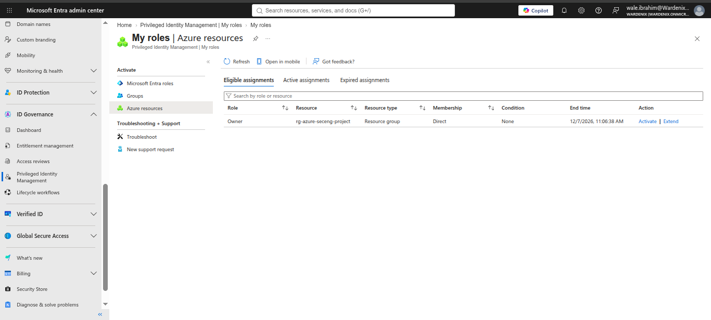

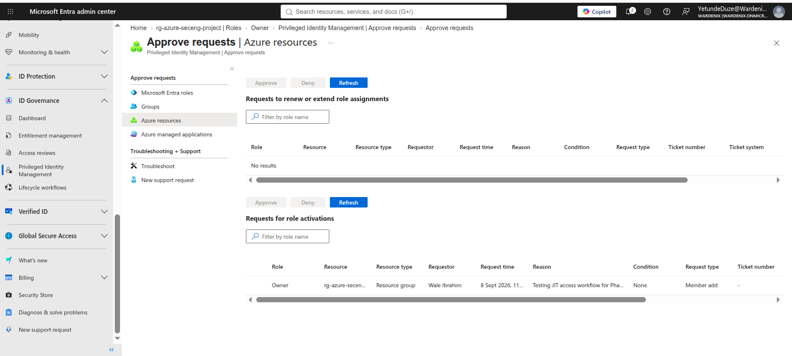

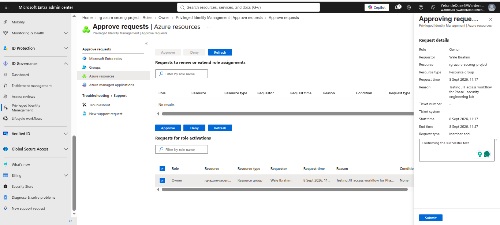

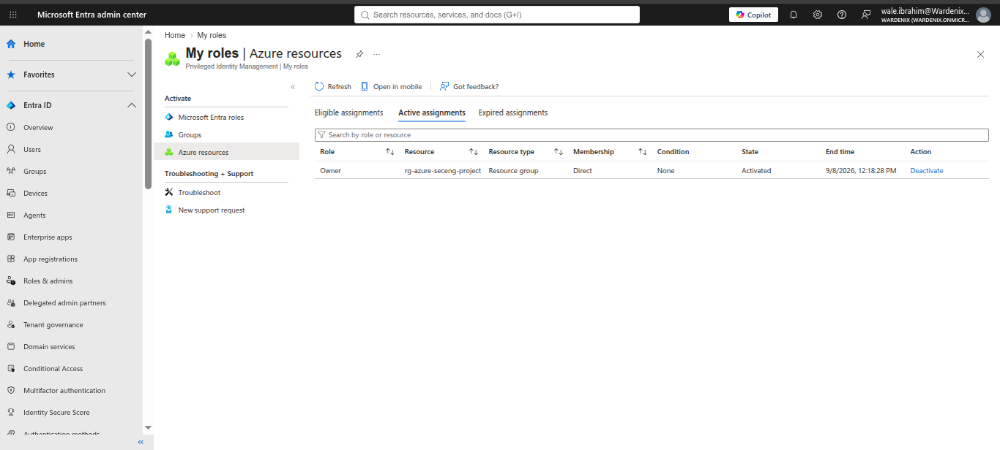

### PIM Audit Log

Every step of the activation is recorded in the PIM audit log - 
role management policy updated, eligibility schedule written, 
assignment schedule written. This is the evidence trail a security 
team uses to investigate privileged access events.

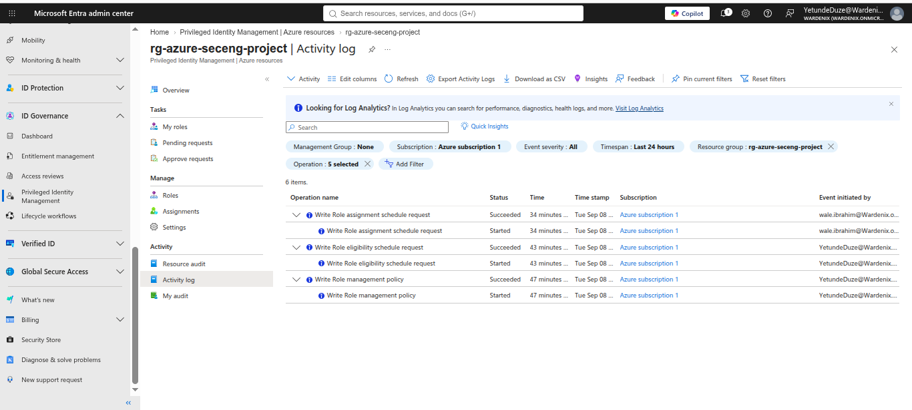

### Attacker Mindset

An attacker who compromises Wale Ibrahim's account gains nothing 
immediately - there is no standing Owner permission to abuse. To 
escalate, they would also need to compromise Yetunde Duze's account 
to approve the activation request, and complete an MFA challenge. 
The approval notification itself is a detection opportunity - an 
unexpected activation request at 3am is an immediate alert signal.

---

## Part 3 - Conditional Access

### What Was Built

Nine Conditional Access policies govern how users authenticate across 
the Wardenix tenant. Policies CA-01 through CA-07 were inherited from 
a prior build and updated to align with this lab environment. CA-08 
and CA-09 were newly created.

| Policy | Scope | Condition | Action | State |
|---|---|---|---|---|
| CA-01 - Require MFA for Admin Portal Access | All users (excl. BreakGlass) | All resources | Require MFA | Report-only |
| CA-02 - Require MFA for Privileged Users | Privileged users | All resources | Require MFA | On |
| CA-03 - Block Legacy Authentication | All users (excl. BreakGlass) | Legacy clients | Block | On |
| CA-04 - Require MFA for All Cloud Apps | All users (excl. BreakGlass) | All resources | Require MFA | On |
| CA-05 - Require MFA on Risky Sign-ins | All users (excl. BreakGlass) | Medium + High risk | Require MFA | On |
| CA-06 - Require Entra Joined Device for IT Admins | IT admins | All resources | Require compliant device | Report-only |
| CA-07 - Require Password Change on High User Risk | All users (excl. BreakGlass) | High user risk | Require MFA + password change | On |
| CA-08 - Executive High-Value Account Protection | David Okafor, Sofia Larsen | All risk levels | Require MFA | On |
| CA-09 - Require Password Reset for High User Risk | All users (excl. BreakGlass) | High user risk | Require MFA + password change | On |

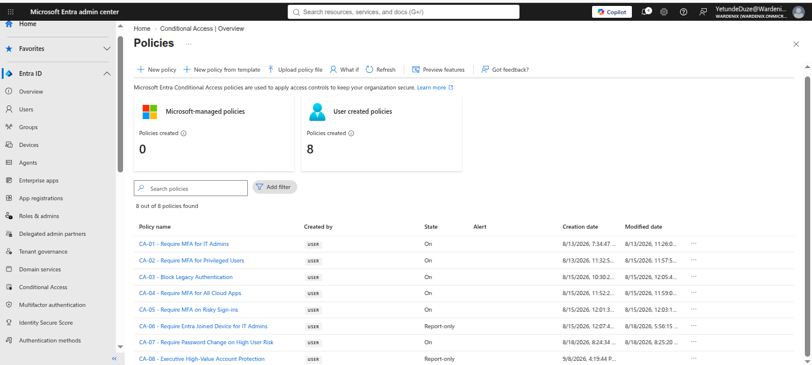

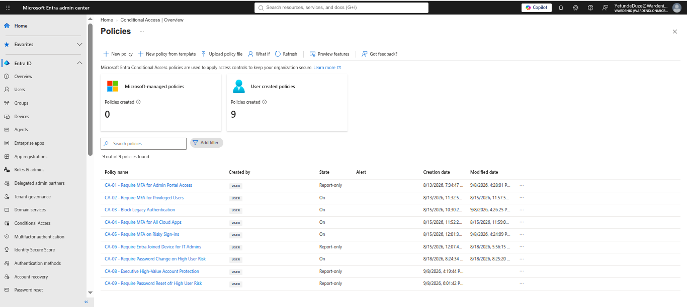

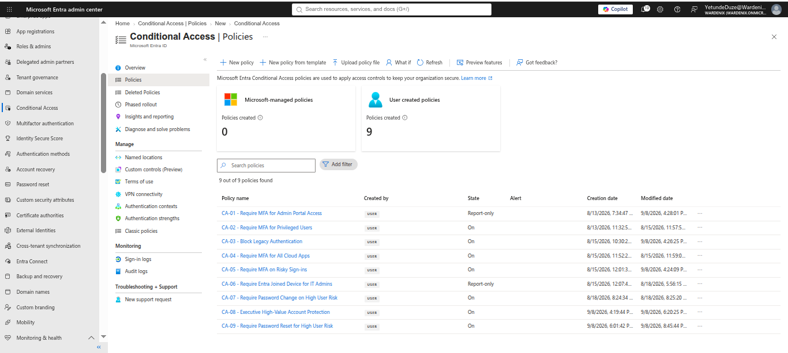

### BreakGlass Admin Verification

The BreakGlass Admin account is excluded from all Conditional Access 
policies. This was verified using the What If tool - zero policies 
apply to the BreakGlass Admin account, confirming emergency access 
is intact regardless of policy state.

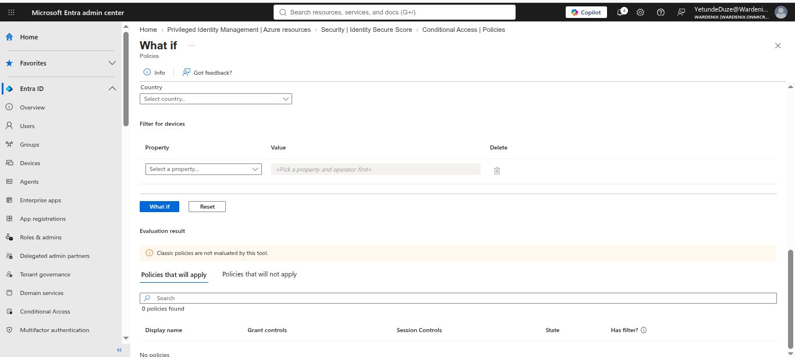

### Named Location

Nigeria was configured as a trusted named location. This enables 
future Conditional Access policies to distinguish between sign-ins 
from known trusted geographies and unknown locations.

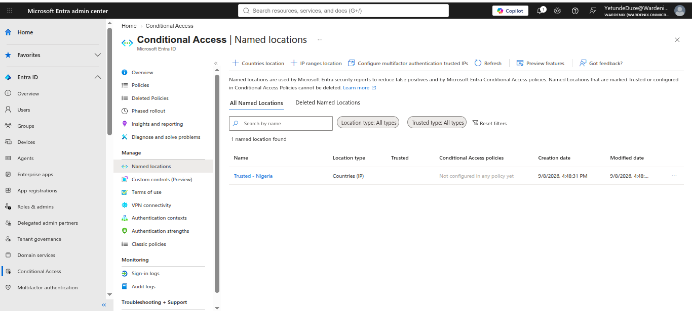

### Why Legacy Auth Matters

CA-03 blocks legacy authentication protocols - Exchange ActiveSync, 
IMAP, SMTP, and other clients that do not support modern 
authentication. These protocols cannot perform MFA. An attacker 
with stolen credentials using a legacy client bypasses every MFA 
control in the tenant. Blocking legacy auth at the CA layer 
eliminates this attack surface entirely regardless of what other 
controls are in place.

### Note on CA-01 Target Resources

Windows Azure Service Management API did not appear in the resource 
picker because its service principal had not yet been provisioned in 
the tenant. Per Microsoft Learn, this service principal is created 
when the Azure portal is first accessed. All resources was selected 
instead - this is Microsoft's recommended baseline MFA posture and 
is a superset that includes Azure Management API coverage.

---

## Part 4 - Entra ID Protection

### What Was Built

Entra ID Protection monitors sign-in and user risk in real time, 
feeding signals into Conditional Access policies that enforce 
remediation automatically.

**Identity Secure Score: 25.22%**

The score reflects the current state of identity security controls 
across the tenant. Improvement actions are tracked and mapped to 
the policies configured in this phase.

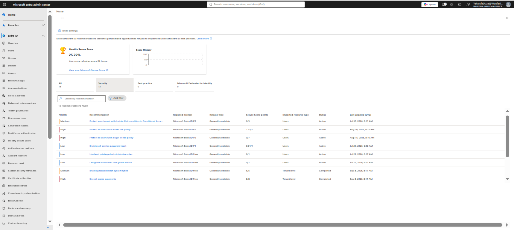

### Risk Simulation - Tor Browser

A risk simulation was performed by signing in as a fresh test user 
(`risk.test@Wardenix.onmicrosoft.com`) via the Tor Browser to 
trigger the anonymous IP address detection.

**Result:** The sign-in was blocked and the account was flagged 
as Medium risk - Anonymous IP address detection confirmed working.

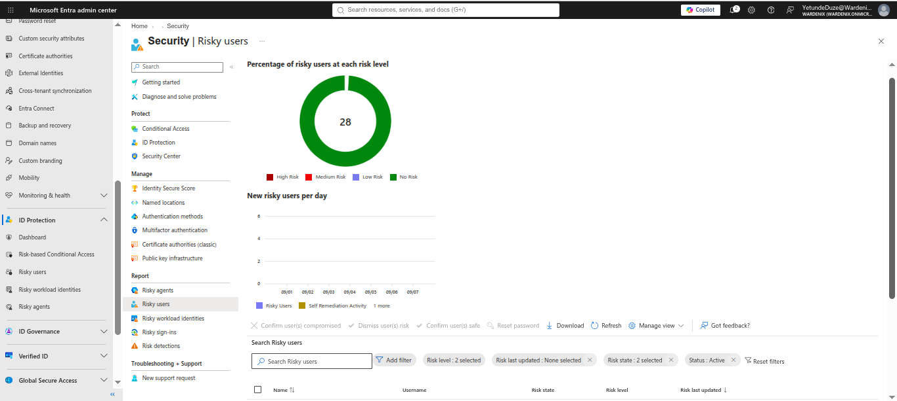

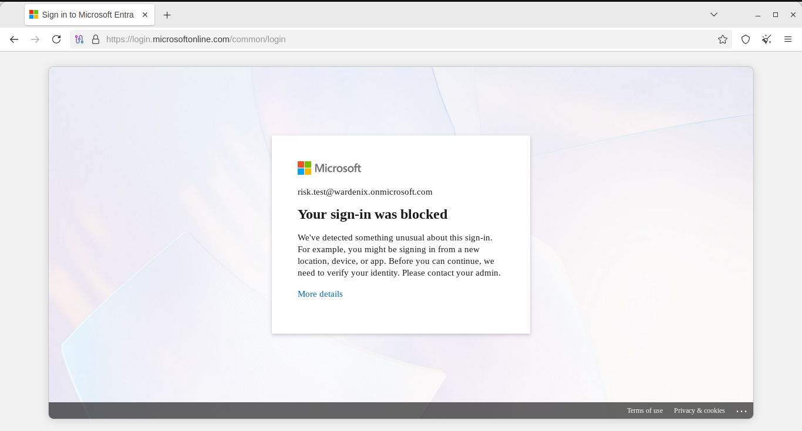

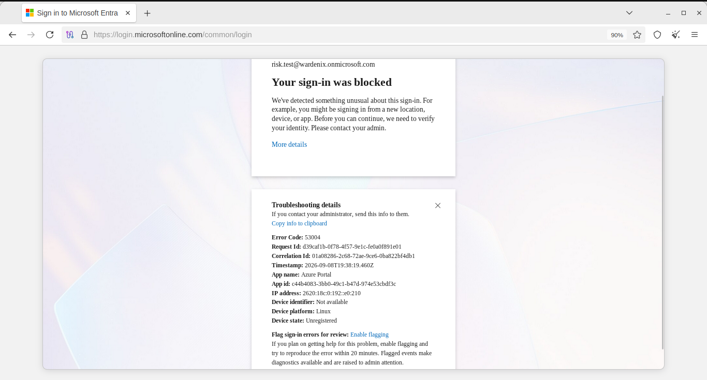

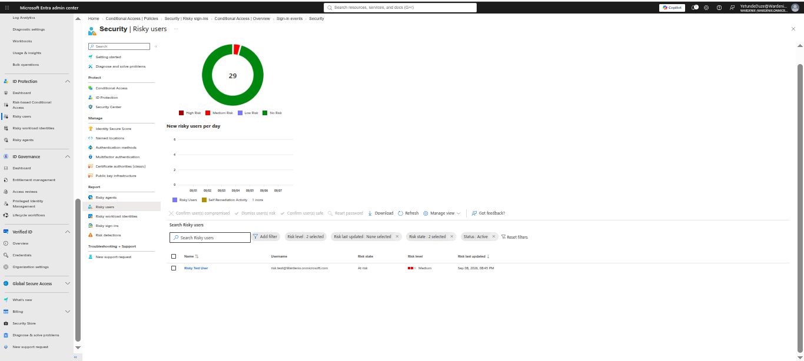

### Detection Suppression Finding

Existing lab accounts (Wale Ibrahim, Mei Chen) were not flagged 
when signing in via Tor. Root cause: both accounts were previously 
marked **Confirm user safe** in a prior project, placing them into 
learning mode per Microsoft's documented behaviour. The detection 
model learned Tor sign-ins as normal behaviour for those accounts 
and suppressed future detections.

**Key distinction documented:**

| Action | Effect |
|---|---|
| Confirm user safe | Removes risk, places account in learning mode, suppresses similar future detections permanently |
| Dismiss user risk | Closes the risk as benign, detection model remains active for future events |

In a production environment, **Confirm user safe** should only be 
used when the activity is confirmed to never pose a risk. 
**Dismiss user risk** is the correct action for all investigation 
and testing workflows.

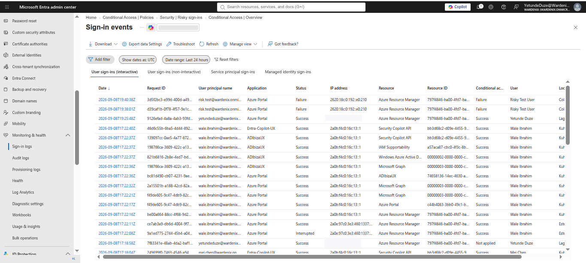

### Attacker Mindset

Credential stuffing attacks use leaked username and password pairs 
from unrelated breaches. Entra ID Protection's leaked credentials 
detection runs continuously against known breach databases. A 
compromised account flagged as High user risk cannot authenticate 
at all - CA-07 and CA-09 force password reset before access is 
restored, cutting off the attacker even if they have valid 
credentials.

---

## Part 5 - App Registrations and Managed Identities

### What Was Built

Application identities were configured following the principle of 
least privilege - no stored credentials anywhere in the environment.

**ASL-WebApp registered** in Entra ID with the following 
delegated permissions, both granted via admin consent:

- `User.Read` - read the signed-in user's own profile only
- `User.ReadBasic.All` - read basic profiles of all users 
  for directory search functionality

Admin consent was granted centrally - no per-user consent prompts. 
User consent was disabled tenant-wide, requiring all permission 
grants to go through an admin approval workflow.

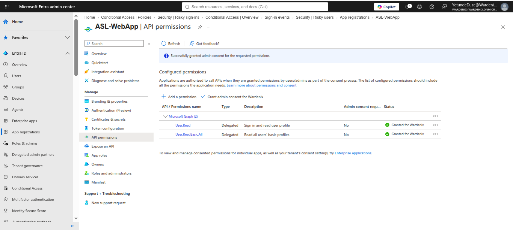

**Managed Identity `mi-asl-app`** (user-assigned) was created and 
assigned the Reader role on `rg-azure-seceng-project`. No 
credentials, secrets, or connection strings are stored anywhere. 
The identity authenticates to Azure services automatically using 
`DefaultAzureCredential`.

**Note on region:** The Managed Identity was deployed to UK South 
rather than West Europe. West Europe is currently restricted for 
new resource creation on Azure free trial subscriptions per 
Microsoft's regional capacity management policy. Managed Identities 
are Entra ID objects and function globally regardless of deployment 
region.

**Tim Contractor** was onboarded as a B2B guest 
(`yet*****@gmail.com`) with time-bound eligible Reader 
access to the resource group - expiring August 2027. External 
users authenticate via their own identity provider and can only 
access what they are explicitly granted.

### Identity Type Reference

| Type | What it is | When to use |
|---|---|---|
| App registration | Blueprint for an application identity | Application code needs to call APIs |
| Service principal | Live instance of an app registration in a tenant | Created automatically when an app is used |
| System-assigned Managed Identity | Tied to one resource, deleted with it | Single-resource services |
| User-assigned Managed Identity | Standalone, attachable to multiple resources | Shared service identity |

### OAuth Consent Governance

User consent was disabled across the tenant. All permission grants 
require admin approval. Reviewers configured: Wale Ibrahim and 
Yetunde Duze. This eliminates OAuth app abuse as an attack vector - 
a malicious app cannot obtain permissions by tricking a user into 
consenting.

---

## Part 6 - Entra Agent ID

### What Was Built

Entra Agent ID is Microsoft's identity and governance framework for 
AI agents. It extends the same Zero Trust controls applied to human 
identities - Conditional Access, Identity Protection, and lifecycle 
governance - to non-human AI agent identities.

**Agent inventory baseline documented** - zero agents registered 
at the start of this lab. This establishes the governance baseline 
before any AI workloads are introduced.

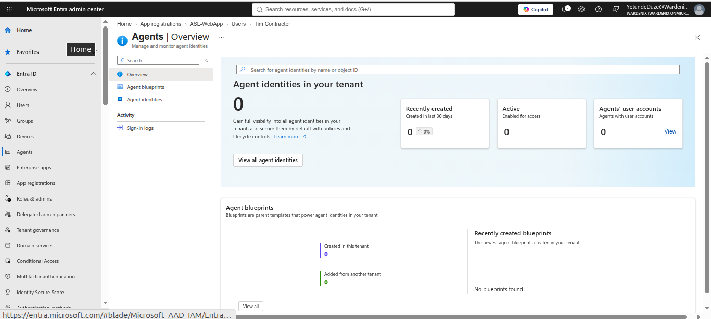

**Role assignments for agent governance:**

- Wale Ibrahim - **Agent ID Administrator** (eligible) - manages 
  agent identity registrations and lifecycle
- Mei Chen - **Attribute Definition Administrator** (eligible) - 
  defines custom security attributes including those applied to agents
- Wale Ibrahim - **Attribute Assignment Administrator** (eligible) - 
  assigns defined attributes to agent identities

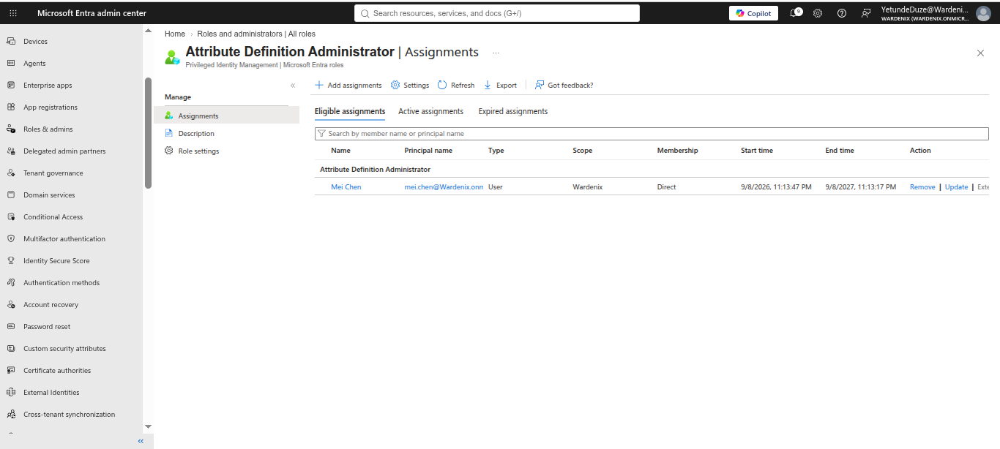

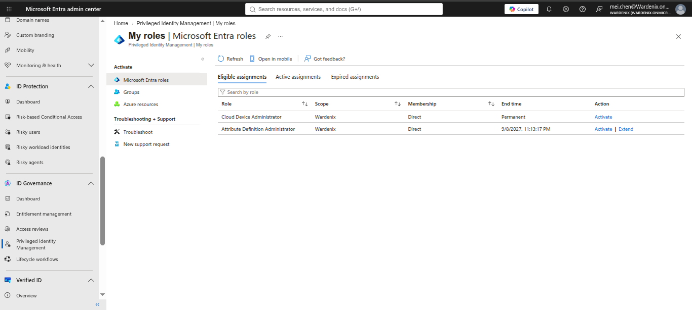

**Custom security attribute set `AgentGovernance` created** with 
two attributes for classifying agent identities:

- `Environment` - Production, Development, Testing
- `DataSensitivity` - High, Medium, Low

These attributes enable Conditional Access policies to apply 
different controls based on what environment an agent runs in and 
what data it can access - for example, blocking Development agents 
from accessing Production resources.

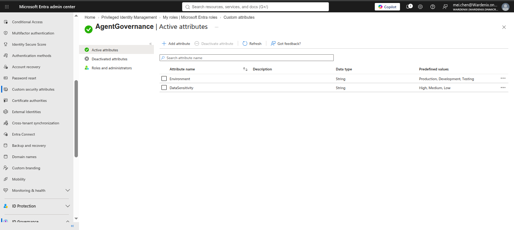

### Licence Boundary - Conditional Access for Agents

Conditional Access policies targeting agent identities require a 
**Microsoft Agent 365** licence - included in Microsoft 365 E7 or 
available as an add-on to E5/Business Premium. This licence is not 
included in Microsoft Entra ID P2.

The agent identities assignment type did not appear in the 
Conditional Access policy builder, confirming the licence 
requirement. CA-006 (Block High-Risk Agent Identities) was 
documented but not deployed.

**Production implication:** Organisations deploying AI agents at 
scale require Agent 365 to apply Zero Trust controls to agent 
identities. Without it, agent identities cannot be targeted by 
Conditional Access policies - relying only on the permissions 
granted at registration time for access control.

### Blast Radius Framework

An AI agent's blast radius is determined by three factors:

- **Permissions granted** - Microsoft Graph scopes, API access, 
  SharePoint site access
- **Resources accessible** - mailboxes, files, databases, 
  downstream APIs
- **Human oversight** - approval requirements, activation 
  controls, access reviews

A compromised agent with `Files.ReadWrite.All` and no human 
oversight can exfiltrate or corrupt an entire SharePoint 
environment silently - no phishing required, no credential theft, 
no detection by traditional endpoint security tools.

**Mitigation controls planned for Phase 09:**
Least-privilege permissions, Defender for AI Service monitoring, 
Purview DSPM for AI, access reviews on agent identities.

---

## Findings and Decisions

| Finding | Decision |
|---|---|
| West Europe restricted for new resources on free trial | All new resources deployed to UK South |
| Windows Azure Service Management API not in resource picker | Used All resources for CA-01 per Microsoft baseline recommendation |
| Conditional Access for agent identities requires Agent 365 licence | Documented as licence boundary, not deployed |
| Confirm user safe suppresses future risk detections permanently | Documented - Dismiss user risk is correct action for testing workflows |
| Global Administrator does not have custom security attribute permissions by default | Attribute roles assigned to Mei Chen and Wale Ibrahim per separation of duties |

---

## What This Phase Demonstrates

- Least-privilege RBAC with custom role definitions and time-bound assignments
- Just-in-time privileged access with approval workflows and full audit trails
- Layered Conditional Access covering MFA, legacy auth blocking, risk-based policies, and executive protection
- Identity threat detection with live risk simulation and documented detection behaviour
- Passwordless application authentication using Managed Identities
- OAuth consent governance eliminating app-based attack vectors
- AI agent identity governance framework with custom security attributes
- Documented licence boundaries with production security implications
