# Phase 02 - Key Vault and Secrets Management

## What Was Built

This phase deploys and hardens Azure Key Vault as the central secrets store for the lab environment, demonstrates the layered controls that protect it, and validates that defence-in-depth works at multiple levels before an attacker could reach vault contents.

---

## Environment

| Item | Value |
|---|---|
| Key Vault | kv-asl-prod |
| Location | UK South |
| SKU | Standard |
| Permission model | Azure RBAC |
| Soft delete retention | 90 days |
| Purge protection | Enabled |

---

## RBAC Assignments

| Principal | Role | Scope |
|---|---|---|
| Yetunde Duze | Key Vault Administrator | kv-asl-prod |
| Mei Chen | Key Vault Secrets Officer | kv-asl-prod |
| mi-asl-app (Managed Identity) | Key Vault Secrets User | kv-asl-prod |
| Sofia Larsen | Key Vault Secrets User | kv-asl-prod |

The access model uses Azure RBAC rather than vault access policies - RBAC gives per-object granularity and a single plane for auditing alongside all other Azure role assignments.

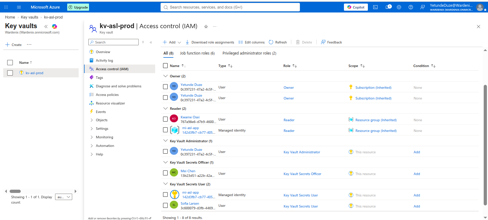

---

## Key

- **Name:** asl-encryption-key
- **Type:** RSA 2048
- **Auto-rotation:** enabled at 10 months
- **Expiry notification:** 30 days before expiry

Auto-rotation policy means the key is replaced before it expires without manual intervention. The 30-day notification window gives time to update any dependent resources before the old key version is retired.

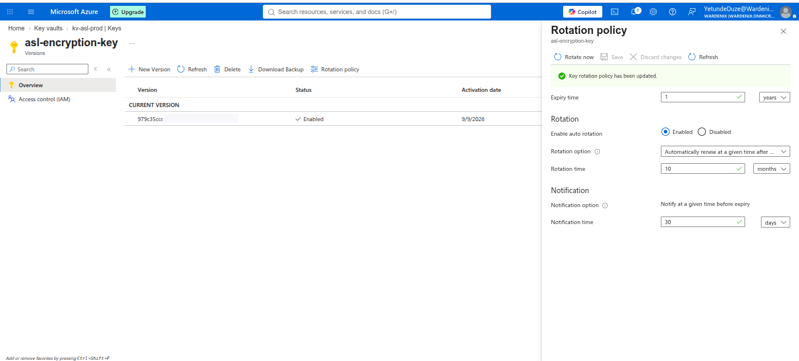

---

## Secrets

**db-connection-string**
Versioned - current version plus one older version retained. Expiry set to 2 years from creation. Versioning ensures that if a connection string is rotated, the previous version remains readable for in-flight connections during a cutover window.

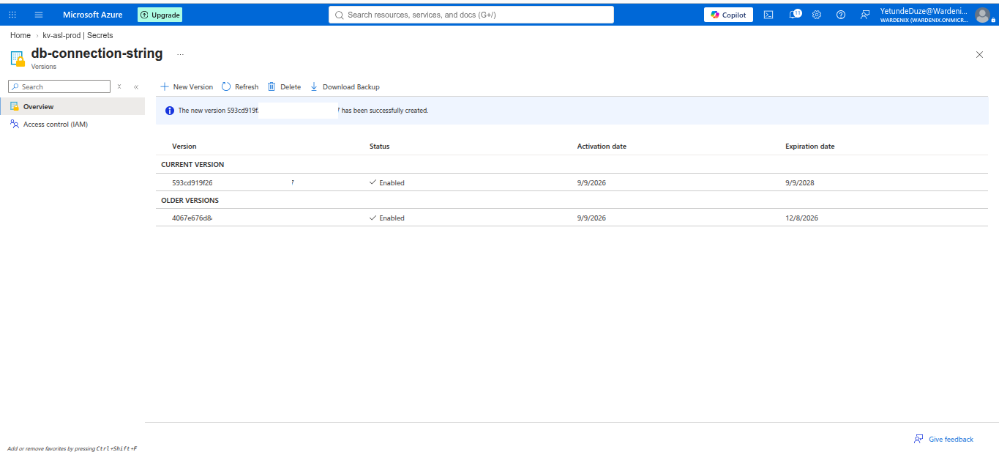

**api-key-external-service**
Created, then deleted to demonstrate soft delete behaviour. Secret was recovered from the deleted state to confirm the 90-day retention window and recovery process before purge protection would prevent permanent deletion.

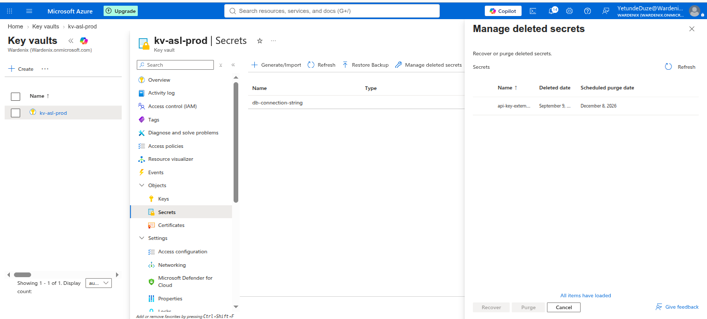

---

## Certificate

- **Name:** asl-internal-cert
- **Type:** Self-signed
- **Common name:** asl-internal.wardenix.onmicrosoft.com
- **Validity:** 12 months
- **Auto-renew:** at 80% of lifetime

Auto-renewal at 80% lifetime means renewal triggers at approximately 9.6 months - well before expiry - without manual tracking.

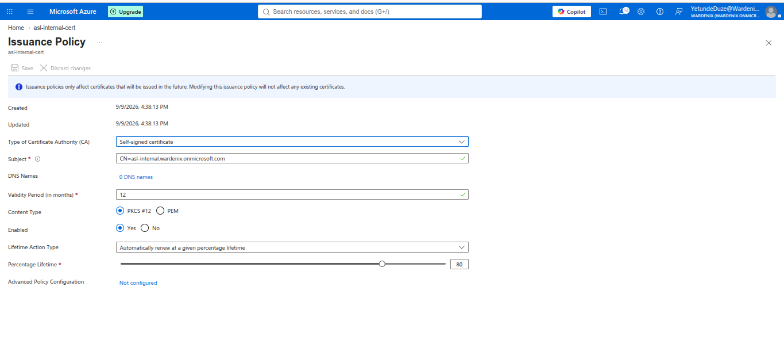

---

## Firewall

The Key Vault firewall is set to **selected networks only**. One trusted IP is allowlisted. Trusted Microsoft services is enabled to permit Azure-native integrations (Defender, Azure Monitor, Azure Backup) that use service tags rather than fixed IPs.

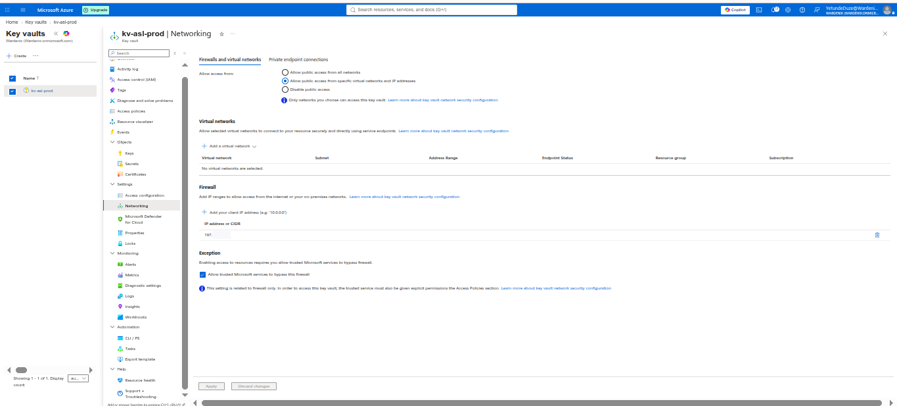
> ⚠️ IP address redacted before upload.

---

## Defender for Key Vault

Microsoft Defender for Key Vault was located in Defender for Cloud workload protection plans. The vault was detected and visible under the plan.

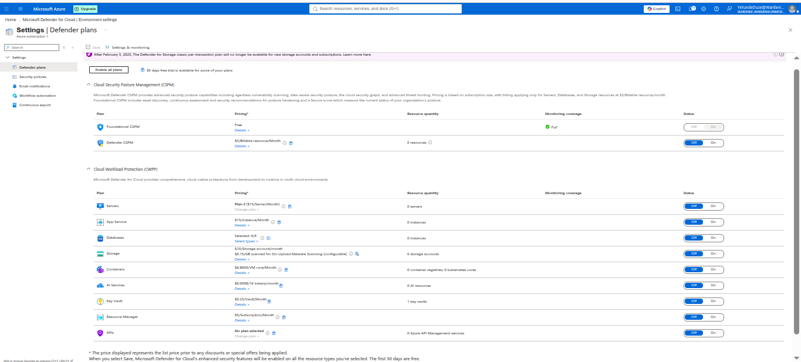

---

## Defence-in-Depth Simulation

Two attack paths were tested to validate that layered controls intercept access before vault contents are reachable.

**Path 1 - Mei Chen via Tor**
Mei Chen holds the Key Vault Secrets Officer role. A sign-in attempt via Tor browser was blocked at the Key Vault firewall level (HTTP 403) - the request never reached vault contents.

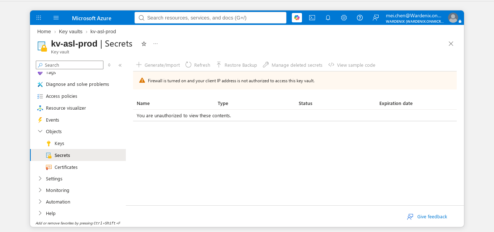

**Path 2 - risk.test via Tor**
risk.test holds no Key Vault role but was added to the vault IAM to create a realistic scenario where a compromised low-privilege account attempts vault access. The Tor sign-in was intercepted earlier - by Conditional Access policy CA-004 (risk-based MFA) - before the request reached the Key Vault firewall. The user was blocked with error code 53004 (MFA required but not satisfied under high-risk conditions).

A second Tor attempt escalated risk.test to High risk in Entra ID Protection, demonstrating cumulative risk scoring.

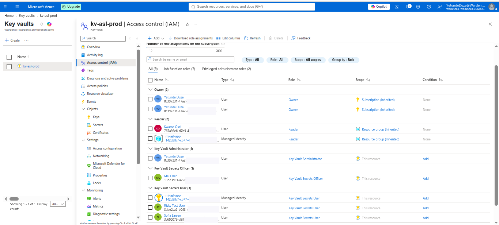

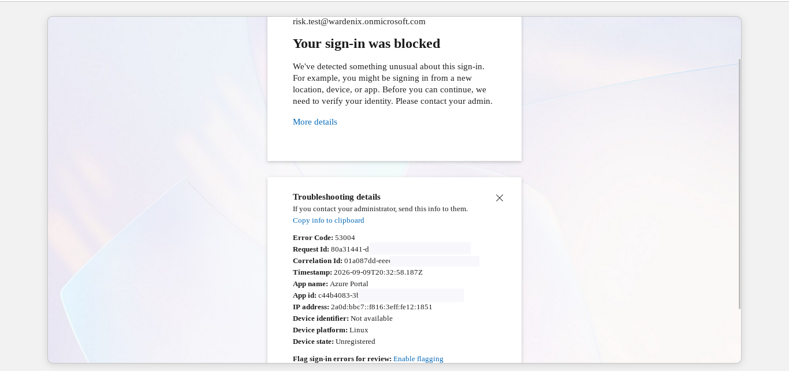

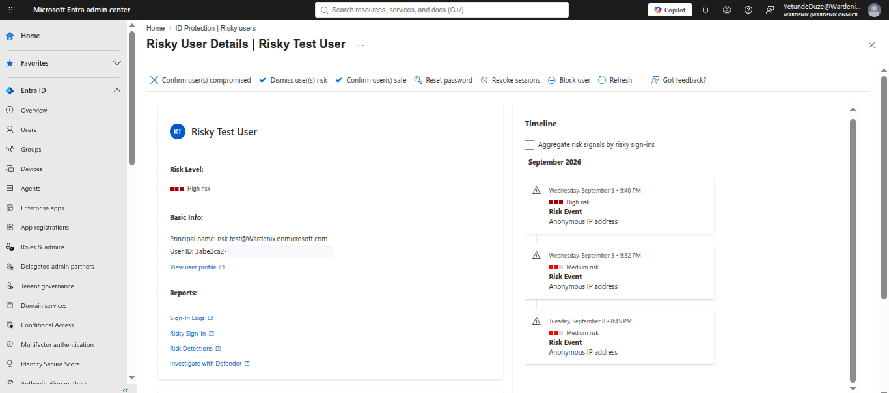

The two paths together document a defence-in-depth model: outer controls (Conditional Access, Entra ID Protection) intercept high-risk identities before they can exercise any permissions inside the vault.

---

## Entra ID Protection - Secure Score Change

| Metric | Value |
|---|---|
| Secure Score at Phase 1 baseline | 33.17% |
| After Phase 2 controls | Improved (see screenshot) |

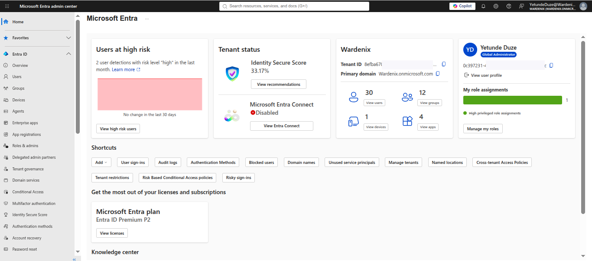

---

## Soft Delete and Purge Protection - Properties

Soft delete is set to 90 days. Purge protection is enabled, meaning no principal - including Global Administrators - can permanently delete the vault or its objects during the retention window.

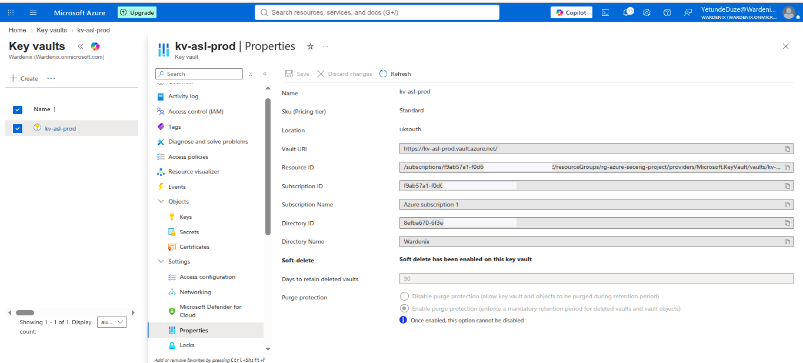
> ⚠️ Subscription ID and Directory ID redacted before upload.

---

## Baseline (Pre-Change State)

Before any Key Vault resources were deployed:
- No Key Vault existed in the subscription
- kv-asl-prod did not exist
- No keys, secrets, or certificates were present
- Defender for Key Vault plan was not enabled

All resources in this phase were net-new additions.

---

## Screenshots

| File | What it shows |
|---|---|
| 01-key-vault-created-uk-south.png | Key Vault overview after creation - location, SKU, properties |
| 02-key-vault-iam-role-assignments.png | RBAC assignments on kv-asl-prod |
| 03-key-rotation-policy-configured.png | Auto-rotation policy on asl-encryption-key |
| 04-secret-versioning-db-connection-string.png | Two versions of db-connection-string |
| 05-key-vault-properties-soft-delete-purge-protection.png | Soft delete 90 days, purge protection enabled _(Sub ID + Dir ID redacted)_ |
| 06-key-vault-firewall-configured.png | Selected networks, trusted Microsoft services enabled _(IP redacted)_ |
| 07-certificate-issuance-policy.png | asl-internal-cert issuance and auto-renew policy |
| 08-deleted-secret-soft-delete-recovery.png | api-key-external-service recovered from deleted state |
| 09-mei-chen-tor-firewall-blocked.png | Mei Chen Tor attempt blocked at vault firewall |
| 10-defender-plans-key-vault-visible.png | Defender for Cloud - Key Vault plan, vault detected |
| 11-defender-for-cloud-overview-baseline.png | Defender for Cloud overview at Phase 2 entry |
| 12-key-vault-iam-risk-test-user-added.png | risk.test added to vault IAM for simulation |
| 13-entra-home-high-risk-users-score-improved.png | Entra ID Protection - high-risk users, score change |
| 14-risk-test-tor-signin-blocked-53004.png | risk.test Tor attempt - CA-004 block, error 53004 |
| 15-risky-test-user-high-risk-escalated.png | risk.test escalated to High risk after second attempt |
